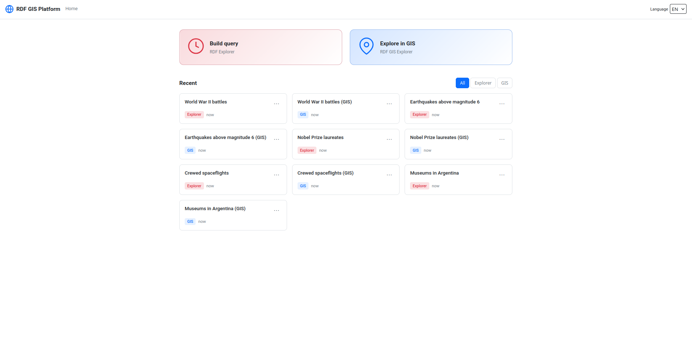
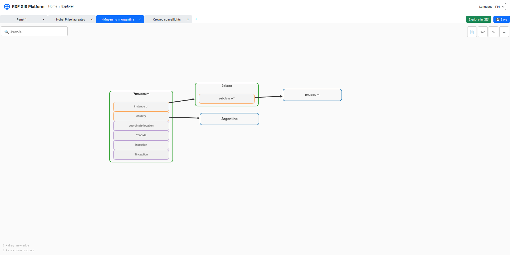

# RDF GIS Explorer

A data exploration platform for graph databases accessible through SPARQL 1.1.
It integrates three deployable products:

- **Shell**: navigation, integration, and dashboard persistence.
- **RDF Explorer**: visual SPARQL query construction.
- **GIS Explorer**: coordinated analysis through table, graph, map, and timeline views.

The platform is independent of both the data domain and any specific engine.
The explorers' backend uses a SPARQL client configurable by URL, credentials,
prefixes, and limits. The bundled configuration targets Wikidata to provide an
immediately usable demo.

Process and responsibility boundaries are detailed in
[docs/product-architecture.md](docs/product-architecture.md). Design decisions
are documented in [docs/design-decisions.md](docs/design-decisions.md) and
[docs/graph-rendering-decisions.md](docs/graph-rendering-decisions.md).

## Visual tour

### Shell

The entry point brings the explorers together and lets users open, manage, and
resume saved dashboards.



### RDF Explorer

The visual builder models a query as a graph and generates its SPARQL
representation without relying on a specific domain.



### GIS Explorer

Results are explored through four coordinated views: map, timeline, table, and
graph.


## Stack

- Angular 21 with Native Federation for the Shell and both remotes.
- NestJS 11 for the three backend processes.
- SQLite for Shell dashboards.
- Cytoscape, Leaflet, vis-timeline, and AG Grid in GIS Explorer.
- pnpm workspaces, Jest, and Vitest.

## Local development

Requirements: Node.js 24.18.0, corepack/pnpm, and nvm for the complete
bootstrap flow.

```bash
./start.sh

# Use a custom SPARQL configuration
./start.sh --env .env.custom
```

`start.sh` activates the Node version, installs dependencies when
necessary, and starts all three frontends and backends with hot reload.

| Service | URL |
| --- | --- |
| Shell | http://localhost:4200 |
| Integrated RDF Explorer | http://localhost:4200/explorer |
| Integrated GIS Explorer | http://localhost:4200/gis |
| Shell API | http://localhost:3000/api |
| RDF API | http://localhost:3001/api |
| GIS API | http://localhost:3002/api |

Each explorer can also run with its own runtime:

```bash
pnpm run dev:rdf-standalone
pnpm run dev:gis-standalone
docker compose up
```

## Structure

```text
packages/
  contracts/          types shared by backends and frontends
  platform-bridge/    Shell-to-remote integration contracts
  explorer-backend/   shared SPARQL runtime, without dashboard persistence
products/
  shell/              host and dashboard-only API
  rdf-explorer/       visual query builder and its own runtime
  gis-explorer/       coordinated views and its own runtime
```

The remotes use `/api` in standalone mode. When integrated into the
Shell, the bridge configures `/rdf-api` and `/gis-api`. Only the
Shell exposes `/api/dashboards` and accesses SQLite.

## API

The explorer runtimes expose query execution and summaries, suggestions,
configuration, and health checks under `/api`. The Shell exposes
CRUD operations at `/api/dashboards` and `/api/dashboards/recent?limit=N`.

## SPARQL configuration

The backend configuration is the single source of truth and reaches the
frontends through `GET /api/config`.

```env
SPARQL_BACKEND=custom
SPARQL_ENDPOINT_URL=https://example.org/sparql
SPARQL_USERNAME=
SPARQL_PASSWORD=
SPARQL_PREFIXES_PATH=packages/explorer-backend/config/prefixes.custom.json
CLASS_COLORS_PATH=packages/explorer-backend/config/class-colors.custom.json
```

Every `SPARQL_BACKEND` value other than `wikidata` uses the generic
SPARQL adapter. The `wikidata` mode adds only that service's public
integrations, such as its search API and `wikibase:label`.

Prefix files are JSON objects of the form `{ "prefix": "uri" }`. The backend does
not inject them at execution time: every query must be self-contained.

| Variable | Default | Purpose |
| --- | --- | --- |
| `SPARQL_BACKEND` | `wikidata` | Configuration identifier |
| `SPARQL_ENDPOINT_URL` | public Wikidata endpoint | SPARQL 1.1 URL |
| `SPARQL_USERNAME` / `SPARQL_PASSWORD` | — | Optional Basic Auth |
| `SPARQL_ENTITY_SEARCH_QUERY` | search by `rdfs:label` | Customizable search |
| `SPARQL_TIMEOUT_MS` | `30000` | Timeout in ms |
| `SPARQL_DEFAULT_LIMIT` / `SPARQL_MAX_LIMIT` | `500` / `2000` | Query limits |
| `SPARQL_PREFIXES_PATH` | `config/prefixes.${SPARQL_BACKEND}.json` | Prefixes |
| `CLASS_COLORS_PATH` | `config/class-colors.${SPARQL_BACKEND}.json` | RDF colors |
| `DASHBOARDS_SQLITE_PATH` | `data/${SPARQL_BACKEND}.sqlite` | Shell SQLite database |
| `SPARQL_PROTECTED_BACKENDS` | `wikidata` | Databases preserved during cleanup |
| `GIS_GRAPH_MAX_NODES` | `300` | Graph node cap |
| `GIS_LOT_DEFAULT_SIZE` | `300` | Initial batch size |
| `GIS_LOT_SIZE_OPTIONS` | `100,300,500` | Available batch sizes |
| `GIS_TABLE_PAGE_SIZE_OPTIONS` | `50,100,200` | Table page sizes |
| `EXPORT_MAX_ROWS` | `50000` | Full-export cap |
| `EXPORT_MIN_PAGE_SIZE` | `250` | Minimum retry page size |
| `SUMMARY_TOP_CATEGORICAL_LIMIT` | `12` | Number of top categorical values |

## Demo dashboards

`seed:demo-dashboards` is retained because it generates functional product examples:
visual-builder workspaces and their equivalent GIS dashboards. It uses the
public endpoint configured by default, not evaluation scenarios or proprietary
extensions.

```bash
cd products/shell/backend
pnpm run seed:demo-dashboards -- --dry-run
pnpm run seed:demo-dashboards
```

Do not run seeds against a persistent database without first checking
`DASHBOARDS_SQLITE_PATH`.

## Quality checks

```bash
pnpm -r --if-present test
pnpm -r --if-present build
docker compose config --quiet
git diff --check
```

## Contact

Martín M. Venturino — `marventurino@gmail.com`