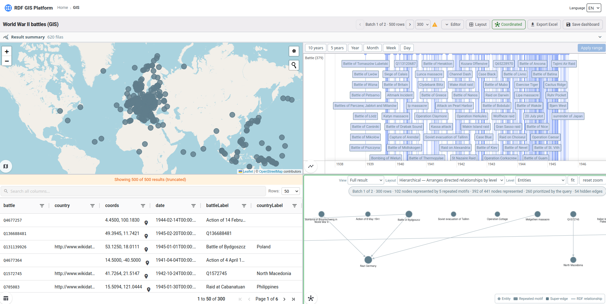

# RDF GIS Explorer

Plataforma de exploración de datos para bases de datos de grafos accesibles
mediante SPARQL 1.1. Integra tres productos desplegables:

- **Shell**: navegación, integración y persistencia de tableros.
- **RDF Explorer**: construcción visual de consultas SPARQL.
- **GIS Explorer**: análisis coordinado en tabla, grafo, mapa y línea temporal.

La plataforma no depende del dominio de los datos ni de un motor concreto. El
backend de los explorers usa un cliente SPARQL configurable por URL,
credenciales, prefixes y límites. La configuración incluida apunta a Wikidata
para ofrecer una demostración inmediata.

La separación de procesos y responsabilidades está detallada en
[docs/product-architecture.md](docs/product-architecture.md). Las decisiones de
diseño se documentan en [docs/design-decisions.md](docs/design-decisions.md) y
[docs/graph-rendering-decisions.md](docs/graph-rendering-decisions.md).

## Recorrido visual

### Shell

El punto de entrada reúne los exploradores y permite abrir, administrar y
retomar tableros guardados.


### RDF Explorer

El constructor visual permite modelar una consulta como grafo y generar su
representación SPARQL sin depender de un dominio específico.


### GIS Explorer

Los resultados se exploran mediante cuatro vistas coordinadas: mapa, línea de
tiempo, tabla y grafo.



## Stack

- Angular 21 con Native Federation para el Shell y los dos remotes.
- NestJS 11 para los tres procesos backend.
- SQLite para los tableros del Shell.
- Cytoscape, Leaflet, vis-timeline y AG Grid en GIS Explorer.
- pnpm workspaces, Jest y Vitest.

## Ejecución local

Requisitos: Node.js 24.18.0, corepack/pnpm y, para el bootstrap completo, nvm.

```bash
./start.sh

# Usar una configuración SPARQL propia
./start.sh --env .env.custom
```

`start.sh` activa la versión de Node, instala dependencias cuando hace falta y
levanta los tres frontends y los tres backends con recarga en caliente.

| Servicio | URL |
| --- | --- |
| Shell | http://localhost:4200 |
| RDF Explorer integrado | http://localhost:4200/explorer |
| GIS Explorer integrado | http://localhost:4200/gis |
| Shell API | http://localhost:3000/api |
| RDF API | http://localhost:3001/api |
| GIS API | http://localhost:3002/api |

También se puede ejecutar cada explorer con su runtime propio:

```bash
pnpm run dev:rdf-standalone
pnpm run dev:gis-standalone
docker compose up
```

## Estructura

```text
packages/
  contracts/          tipos compartidos entre backend y frontends
  platform-bridge/    contratos de integración Shell-remotes
  explorer-backend/   runtime SPARQL común, sin persistencia de tableros
products/
  shell/              host y API exclusiva de tableros
  rdf-explorer/       constructor visual de consultas y runtime propio
  gis-explorer/       vistas coordinadas y runtime propio
```

Los remotes usan `/api` en modo standalone. Integrados en el Shell, el bridge
configura `/rdf-api` y `/gis-api`. Solo el Shell publica `/api/dashboards` y
accede a SQLite.

## API

Los runtimes de los explorers publican ejecución y resumen de consultas,
sugerencias, configuración y health checks bajo `/api`. El Shell publica el
CRUD `/api/dashboards` y `/api/dashboards/recent?limit=N`.

## Configuración SPARQL

La configuración es fuente única de verdad en el backend y llega a los
frontends mediante `GET /api/config`.

```env
SPARQL_BACKEND=custom
SPARQL_ENDPOINT_URL=https://example.org/sparql
SPARQL_USERNAME=
SPARQL_PASSWORD=
SPARQL_PREFIXES_PATH=packages/explorer-backend/config/prefixes.custom.json
CLASS_COLORS_PATH=packages/explorer-backend/config/class-colors.custom.json
```

Todo valor de `SPARQL_BACKEND` distinto de `wikidata` usa el adaptador SPARQL
genérico. El modo `wikidata` añade únicamente las integraciones públicas
propias de ese servicio, como su API de búsqueda y `wikibase:label`.

Los archivos de prefixes son JSON `{ "prefijo": "uri" }`. El backend no los
inyecta al ejecutar: cada consulta debe ser autocontenida.

| Variable | Default | Uso |
| --- | --- | --- |
| `SPARQL_BACKEND` | `wikidata` | Identificador de la configuración |
| `SPARQL_ENDPOINT_URL` | endpoint público de Wikidata | URL SPARQL 1.1 |
| `SPARQL_USERNAME` / `SPARQL_PASSWORD` | — | Basic Auth opcional |
| `SPARQL_ENTITY_SEARCH_QUERY` | búsqueda por `rdfs:label` | Búsqueda personalizable |
| `SPARQL_TIMEOUT_MS` | `30000` | Timeout en ms |
| `SPARQL_DEFAULT_LIMIT` / `SPARQL_MAX_LIMIT` | `500` / `2000` | Límites de consulta |
| `SPARQL_PREFIXES_PATH` | `config/prefixes.${SPARQL_BACKEND}.json` | Prefixes |
| `CLASS_COLORS_PATH` | `config/class-colors.${SPARQL_BACKEND}.json` | Colores RDF |
| `DASHBOARDS_SQLITE_PATH` | `data/${SPARQL_BACKEND}.sqlite` | SQLite del Shell |
| `SPARQL_PROTECTED_BACKENDS` | `wikidata` | Bases preservadas por la limpieza |
| `GIS_GRAPH_MAX_NODES` | `300` | Tope de nodos del grafo |
| `GIS_LOT_DEFAULT_SIZE` | `300` | Tamaño de lote inicial |
| `GIS_LOT_SIZE_OPTIONS` | `100,300,500` | Tamaños disponibles |
| `GIS_TABLE_PAGE_SIZE_OPTIONS` | `50,100,200` | Paginación de tabla |
| `EXPORT_MAX_ROWS` | `50000` | Tope del export completo |
| `EXPORT_MIN_PAGE_SIZE` | `250` | Página mínima al reintentar |
| `SUMMARY_TOP_CATEGORICAL_LIMIT` | `12` | Valores del top categórico |

## Tableros demo

Se conserva `seed:demo-dashboards` porque genera ejemplos funcionales del
producto: workspaces del constructor visual y sus tableros GIS equivalentes.
Usa el endpoint público configurado por defecto, no escenarios de evaluación
ni extensiones propietarias.

```bash
cd products/shell/backend
pnpm run seed:demo-dashboards -- --dry-run
pnpm run seed:demo-dashboards
```

No se deben ejecutar seeds sobre una base persistente sin revisar antes
`DASHBOARDS_SQLITE_PATH`.

## Calidad

```bash
pnpm -r --if-present test
pnpm -r --if-present build
docker compose config --quiet
git diff --check
```

## Contacto

Martín M. Venturino — `marventurino@gmail.com`
