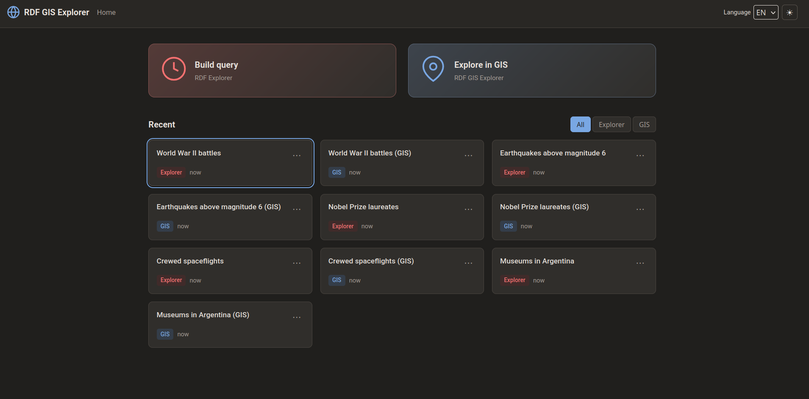
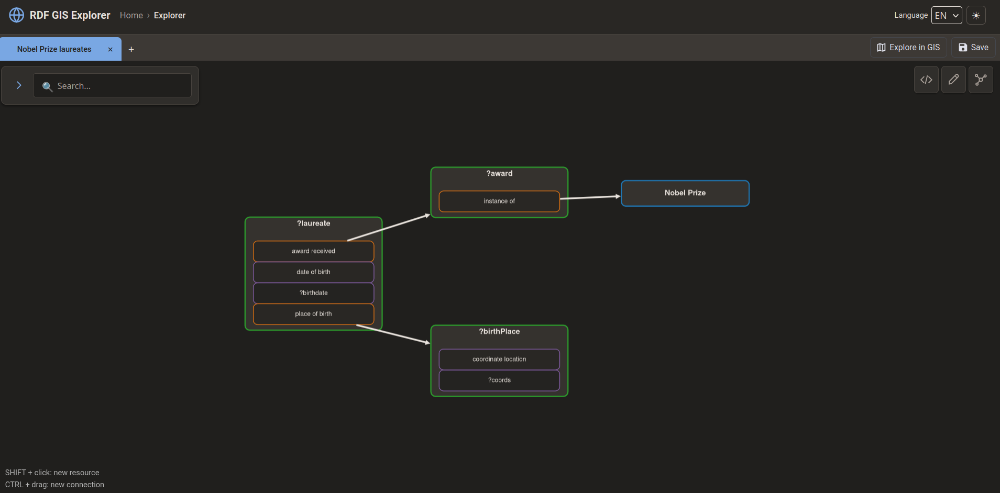

# RDF GIS Explorer

A data exploration platform for graph databases accessible through SPARQL 1.1.
It integrates three deployable products:

- **Shell**: navigation, integration, and dashboard persistence.
- **RDF Explorer**: visual SPARQL query construction.
- **GIS Explorer**: coordinated analysis through table, graph, map, and timeline views.

The platform is independent of both the data domain and any specific engine.
The explorers' backend uses a SPARQL client configurable by URL, credentials,
prefixes, and limits. The bundled configuration targets Wikidata to provide an
immediately usable demo.

Process and responsibility boundaries are detailed in
[docs/product-architecture.md](docs/product-architecture.md). Design decisions
are documented in [docs/design-decisions.md](docs/design-decisions.md) and
[docs/graph-rendering-decisions.md](docs/graph-rendering-decisions.md).

## Visual tour

### Shell

The entry point brings the explorers together and lets users open, manage, and
resume saved dashboards.



### RDF Explorer

The visual builder models a query as a graph and generates its SPARQL
representation without relying on a specific domain.



### GIS Explorer

Results are explored through four coordinated views: map, timeline, table, and
graph.


## Stack

- Angular 21 with Native Federation for the Shell and both remotes.
- NestJS 11 for the three backend processes.
- SQLite for Shell dashboards.
- Cytoscape, Leaflet, vis-timeline, and AG Grid in GIS Explorer.
- pnpm workspaces, Jest, and Vitest.

## Local development

Requirements: Node.js 24.18.0, corepack/pnpm, and nvm for the complete
bootstrap flow.

```bash
./start.sh

# Use a custom SPARQL configuration
./start.sh --env .env.custom
```

`start.sh` activates the Node version, installs dependencies when
necessary, and starts all three frontends and backends with hot reload.

| Service | URL |
| --- | --- |
| Shell | http://localhost:4200 |
| Integrated RDF Explorer | http://localhost:4200/explorer |
| Integrated GIS Explorer | http://localhost:4200/gis |
| Shell API | http://localhost:3000/api |
| RDF API | http://localhost:3001/api |
| GIS API | http://localhost:3002/api |

Each explorer can also run with its own runtime:

```bash
pnpm run dev:rdf-standalone
pnpm run dev:gis-standalone
docker compose up
```

## Structure

```text
packages/
  contracts/          types shared by backends and frontends
  platform-bridge/    Shell-to-remote integration contracts
  explorer-backend/   shared SPARQL runtime, without dashboard persistence
products/
  shell/              host and dashboard-only API
  rdf-explorer/       visual query builder and its own runtime
  gis-explorer/       coordinated views and its own runtime
```

The remotes use `/api` in standalone mode. When integrated into the
Shell, the bridge configures `/rdf-api` and `/gis-api`. Only the
Shell exposes `/api/dashboards` and accesses SQLite.

## API

The explorer runtimes expose query execution and summaries, suggestions,
configuration, and health checks under `/api`. The Shell exposes
CRUD operations at `/api/dashboards` and `/api/dashboards/recent?limit=N`.

## SPARQL configuration

The backend configuration is the single source of truth and reaches the
frontends through `GET /api/config`.

```env
SPARQL_BACKEND=custom
SPARQL_ENDPOINT_URL=https://example.org/sparql
SPARQL_USERNAME=
SPARQL_PASSWORD=
SPARQL_PREFIXES_PATH=packages/explorer-backend/config/prefixes.custom.json
CLASS_COLORS_PATH=packages/explorer-backend/config/class-colors.custom.json
```

Every `SPARQL_BACKEND` value other than `wikidata` uses the generic
SPARQL adapter. The `wikidata` mode adds only that service's public
integrations, such as its search API and `wikibase:label`.

Prefix files are JSON objects of the form `{ "prefix": "uri" }`. The backend does
not inject them at execution time: every query must be self-contained.

| Variable | Default | Purpose |
| --- | --- | --- |
| `SPARQL_BACKEND` | `wikidata` | Configuration identifier |
| `SPARQL_ENDPOINT_URL` | public Wikidata endpoint | SPARQL 1.1 URL |
| `SPARQL_USERNAME` / `SPARQL_PASSWORD` | — | Optional Basic Auth |
| `SPARQL_ENTITY_SEARCH_QUERY` | search by `rdfs:label` | Entity/resource search template (`$keyword`, `$limit`, optional `$offset`) |
| `SPARQL_SERVER_TIMEOUT_PARAM` | `timeout` for GraphDB; disabled elsewhere | Server timeout form parameter, in seconds; empty disables it |
| `SPARQL_TIMEOUT_MS` | `30000` | Timeout in ms |
| `SPARQL_MAX_LIMIT` | `2000` | Maximum rows returned by a query request; also used when the request omits a response limit |
| `SPARQL_PREFIXES_PATH` | `config/prefixes.${SPARQL_BACKEND}.json` | Prefixes |
| `CLASS_COLORS_PATH` | `config/class-colors.${SPARQL_BACKEND}.json` | RDF colors |
| `DASHBOARDS_SQLITE_PATH` | `data/${SPARQL_BACKEND}.sqlite` | Shell SQLite database |
| `SPARQL_PROTECTED_BACKENDS` | `wikidata` | Databases preserved during cleanup |
| `GIS_GRAPH_MAX_NODES` | `300` | Graph node cap |
| `GIS_LOT_DEFAULT_SIZE` | `300` | Initial batch size |
| `GIS_LOT_SIZE_OPTIONS` | `100,300,500` | Available batch sizes |
| `GIS_TABLE_PAGE_SIZE_OPTIONS` | `50,100,200` | Table page sizes |
| `EXPORT_MAX_ROWS` | `50000` | Full-export cap |
| `EXPORT_MIN_PAGE_SIZE` | `250` | Minimum retry page size |
| `SUMMARY_TOP_CATEGORICAL_LIMIT` | `12` | Number of top categorical values |

## Guided RDF discovery

RDF Explorer starts with one search field for **classes** and **resources**.
Classes appear first in green, followed by resources in blue; there is no
relationship search tab. Class discovery combines terms used in triples with
explicit RDF/RDFS/OWL declarations; labels are optional and URI names remain
searchable. Resource search reuses the endpoint's configured entity search (by
default `rdfs:label`). Requests run sequentially, classes then resources, and
pagination keeps each group's own offset. Enter text to start a search.

Drag a class onto the canvas to create a named typed variable, or drag a resource
to add the concrete resource. Search results have no exploration buttons.
The right-hand **Explorer** icon replaces the separate description and connection
tabs. It uses the same bounded connection API for variables and concrete resources;
concrete resources also show a preview value per observed relationship/type.
A single local filter matches relation names, URIs, target types and preview values.
Drag a relationship onto the canvas to add its typed variable/literal branch, or
drag a concrete value to constrain that branch. Direction and the original source
are retained even if selection changes during the drag. Existing compatible
branches are reused. The newly added element becomes the exploration focus.
There are no separate required/optional/example controls, per-property filters,
or path-finder controls in this panel. Optionality and filters remain editable
through the existing editor.

Suggestions use the current connected query component and its filters. Counts
refer to distinct entities in bounded samples, not universal schema constraints.
The endpoint's configured inference/dataset scope applies; the client does not add
reasoning. Classes declared without instances may have no observed connections.
The path API remains available, but the simplified panel does not call it.

Read-only discovery APIs belong to the Explorer backends:
`GET /api/discovery/catalog?kind=class&q=House&offset=0`,
`POST /api/discovery/connections`, and `POST /api/discovery/paths`.
Shared request/result types live in `@rdfgis/contracts`.

Typing waits 350 ms before searching. Identical submits/page clicks do not
restart work, and abandoned HTTP requests cancel queued or active discovery work.
All discovery endpoints share a bounded queue per backend process (one active
job by default); incoming and outgoing queries run sequentially. Identical jobs
share their upstream execution. Resource searches reuse the existing entity search
adapter and `SPARQL_ENTITY_SEARCH_QUERY` configuration: by default they search
`rdfs:label`, not all literal predicates. Custom templates return `?uri ?label`
and accept `$keyword`, `$limit` and optionally `$offset`; templates without
`$offset` receive OFFSET/LIMIT through the SPARQL parser. An indexed search or additional
literal predicates can be configured in that template. Class/property searches read bounded
samples of observed and declared **statements** (1000 each by default, without
DISTINCT, sorting or text matching). Deduplication and URI/label matching happen
only over these samples, then page distinct terms (50 by default). Labels and
evidence are resolved only for that page. One extra term detects another page.
The UI identifies catalogue previews as samples: terms outside them may be absent,
even when searching by their exact name. `sampled` and `truncated` are true for
generic class/property previews; `nextOffset` exists only when the sample has another page.
Each category/text/page is cached separately, and abandoned searches cancel when
no other caller needs them. No full class/property inventory is loaded.

Wikidata typed searches use its public
text index, then check bounded entity metadata for `P279` class declarations;
properties become `wdt:P…` predicates. Classes with only incoming assertions may
be absent from this preview. Wikidata class browsing samples `P279` assertions, resolves labels through its
API and deduplicates/pages locally. Property browsing samples `wikibase:directClaim`.
Generic RDF endpoints default to `rdf:type` and OWL/RDFS declarations.
Discovery does not automatically retry upstream 429 responses. An upstream
failure pauses new upstream discovery work for the configured cooldown; cached
results remain available. Cooldown responses include `retryAfterSeconds` and a
`Retry-After` header; blocked requests do not extend that pause. Catalogue search displays a short failure message, without a countdown or
a retry button; editing the text or submitting explicitly starts a new request.
These controls apply per backend process, not to other
applications or manual SPARQL queries. Cancelling HTTP limits client-side work;
GraphDB requests also carry the RDF4J `timeout` parameter (one second before the
HTTP deadline, rounded down, minimum one second). An abandoned discovery request
keeps its queue slot until that bounded execution finishes, preventing typing from
launching overlapping server queries. Other endpoints may configure the supported
parameter with `SPARQL_SERVER_TIMEOUT_PARAM`; an empty value disables it.
The server's own timeout remains a backstop if it does not honor per-query limits.

| Variable | Default | Meaning |
|---|---|---|
| `DISCOVERY_SAMPLE_SIZE` | `200` | Distinct focus entities inspected per neighborhood |
| `DISCOVERY_RESULT_LIMIT` | `60` | Connection groups per direction |
| `DISCOVERY_TIMEOUT_MS` | `8000` | Timeout per discovery SPARQL request |
| `DISCOVERY_CACHE_TTL_MS` | `60000` | Successful resource/context cache lifetime |
| `DISCOVERY_CATALOG_TTL_MS` | `300000` | Successful catalogue page cache lifetime |
| `DISCOVERY_CLASS_PREDICATE` | `rdf:type` | Full IRI for observed classes in the generic SPARQL catalogue |
| `DISCOVERY_SUBCLASS_PREDICATE` | unset | Optional full IRI for subclass declarations in the generic SPARQL catalogue |
| `DISCOVERY_CATALOG_SAMPLE_SIZE` | `1000` | Statement rows per observed/declared catalogue sample, before distinct/filter/sort |
| `DISCOVERY_CATALOG_PAGE_SIZE` | `50` | Terms per catalogue page (SPARQL uses one lookahead; Wikidata API caps pages at 50) |
| `DISCOVERY_MAX_CONCURRENT` | `1` | Maximum active discovery jobs per backend process |
| `DISCOVERY_QUEUE_LIMIT` | `4` | Maximum waiting distinct jobs; overflow returns 429 |
| `DISCOVERY_FAILURE_COOLDOWN_MS` | `30000` | Pause new upstream discovery work after a failure |
| `DISCOVERY_PATH_TIMEOUT_MS` | `20000` | Total path search time budget |
| `DISCOVERY_PATH_BUDGET` | `12` | Maximum neighborhoods inspected per path search |
| `DISCOVERY_PATH_DEPTH` | `4` | Maximum additional path length (12 steps total) |
| `DISCOVERY_PATH_RESULT_LIMIT` | `5` | Maximum verified paths returned |

## Demo dashboards

`seed:demo-dashboards` is retained because it generates functional product examples:
visual-builder workspaces and their equivalent GIS dashboards. It uses the
public endpoint configured by default, not evaluation scenarios or proprietary
extensions.

```bash
cd products/shell/backend
pnpm run seed:demo-dashboards -- --dry-run
pnpm run seed:demo-dashboards
```

Do not run seeds against a persistent database without first checking
`DASHBOARDS_SQLITE_PATH`.

## Quality checks

```bash
pnpm -r --if-present test
pnpm -r --if-present build
docker compose config --quiet
git diff --check
```

## Contact

Martín M. Venturino — `marventurino@gmail.com`
